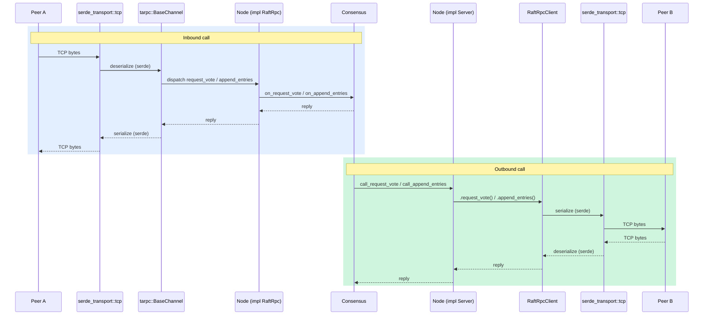

# Architecture: Node, tokio, tarpc, serde



## Flow for an inbound call (another node calls us)

1. TCP bytes arrive
2. `serde_transport` deserializes with serde
3. tarpc `BaseChannel` matches request ID
4. Dispatches to `Node::request_vote`
5. Calls `Consensus::on_request_vote`
6. Reply serialized back

## Flow for an outbound call (we call a peer)

1. `Consensus` calls `Node::call_request_vote`
2. `RaftRpcClient::request_vote` called
3. tarpc serializes with serde
4. Sends over TCP
5. Awaits reply future driven by tokio

## Layering summary

```
Node logic
  └── tarpc  (request/reply multiplexing, context, generated client/server)
        └── serde_transport  (frame + serialize/deserialize)
              └── tokio::net::TcpStream  (async I/O)
                    └── tokio runtime  (drives all futures)
```
